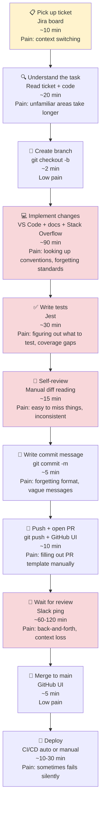

# Workflow Map — Development Pipeline

## Current Workflow (Annotated)

## Step Breakdown

| Step | Time (min) | Tools | Main Pain Points |
|------|-----------|-------|-----------------|
| Ticket pickup | 10 | Jira, Slack | Context switching costs focus |
| Understanding | 20 | Code editor, Jira | Unknown areas need exploration |
| Branch creation | 2 | Git | Minimal — just typing |
| Implementation | 90 | VS Code, docs, SO | Remembering conventions, looking up patterns |
| Writing tests | 30 | Jest, docs | Figuring out what to test, hitting coverage targets |
| Self-review | 15 | Git diff, manual | Inconsistent — easy to miss things |
| Commit message | 5 | Git | Vague messages, forgetting format |
| Push + PR | 10 | Git, GitHub | Manual PR description writing |
| Code review wait | 60–120 | GitHub, Slack | Blocking time, context loss when it comes back |
| Merge + deploy | 15 | GitHub, CI | Occasional flaky deploys |

**Total active work per feature: ~182 min (3+ hours)**
**Total wall clock time (inc. review wait): ~300 min (5 hours)**
